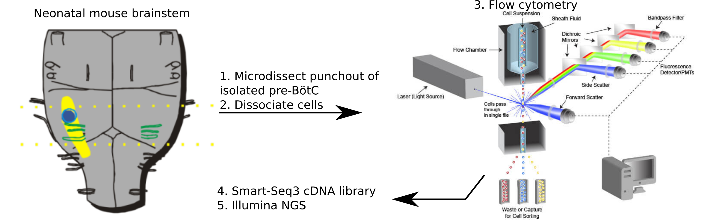
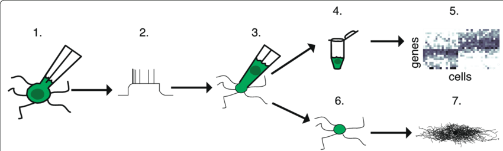
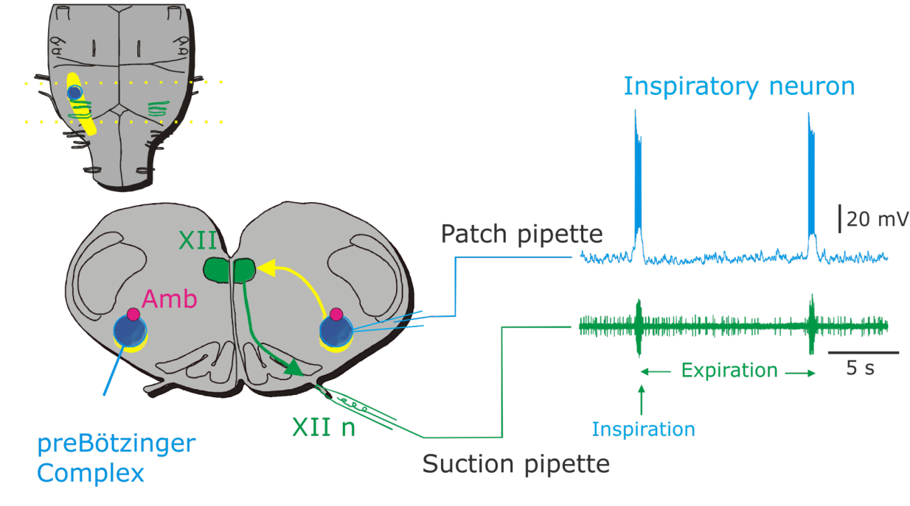

= Modeling brainstem neuronal networks that drive breathing
Wiktor Phillips <wiktor.phillips@ki.se>
v0.1, 2020-01-20
:toc:
       
Infection in newborn infants can contribute to respiratory dysfunction.
*However* inflammation doesn't disrupt breathing as severely after approximately
12 months of age. 

Why?:: _Likely answer: The resiliency of respiratory control is weaker and more
vulnerable to stress. Or more simply, the biophysical properties of cells
generating the drive to breathe are different == developmental immaturity._ 

What's different?:: _Much harder to answer: we don't entirely know_

.Pragmatic problem
****
We want to resolve the physiological consequences of developmental changes in
the brain happening near birth, focusing on the brainstem circuits that generate
rhythmic motor output associated with breathing. 
****

.Julia and Neural ODEs
****
I think there's two things that may prove interesting in the space of neural
ODEs and Julia-esque solutions to scientific computing.

1. Universal differential equations might be leveraged as a (more) data-driven approach
to development of conductance-based models of neurons. Augmenting models with
neural nets might tighten the relationship between real-world data and in silico
simulation. 

2. There's also a *problem of language*. Domain-specific languages for
generating efficient machine code simulation of biologically-inspired models of
neurons and neural networks is https://doi.org/10.3389/fninf.2018.00068[nothing
new in neuroscience], but there's obvious trade-offs going on between
composability, portability, architecture support and model flexibility.
****

== Experimental strategy

=== High-throughput single-cell transcriptomics

Microdissect tissue samples from the brainstem of newborn mice at different
stages of development (e.g. late embryonic period -> early postnatal ages ->
juvenile ages). Dissociate tissue samples and sort isolated single cells into a
microwell plate for RNAseq. Resulting transcriptomic data hopefully resolves the
underlying trajectory of changes in gene expression occuring within cellular
subpopulations (e.g. using pseudotime ordering,
https://doi.org/10.1038/s41586-018-0414-6[RNA velocity], or both).

.Next-gen sequencing workflow

=== Annotate single-cell data with physiological data using PatchSeq

https://doi.org/10.1038/nprot.2017.120[PatchSeq] involves recording
intracellular voltage and subsequently aspirating the cell's cytosol in order to
capture mRNA for later cDNA library generation.  Therefore a physiological
readout of behavior (voltage/current recording) gets paired with the transcriptomic
profile of a specific cell. These data points compliment the superset of
transcriptomic data described in the preceding section.

.PatchSeq workflow (Cadwell et al. 2017)

=== Model neurons and fit to real data

Build a detailed yet flexible Hodgkin-Huxley model that consists of things we
know about (e.g. known prominent membrane currents) and neural nets to account
for things we may not have considered or can't easily model (e.g.  unmeasurable
distally located currents, stochasticity of activity, other signaling pathways).
Fit such a model _directly_ to experimental recordings of spontaneous
respiratory neuron activity. Ideas for structure of the model discussed in Model
Ideas below.

=== Light field microscopy for whole network data

Light field microscopy can be used to take time-lapse recordings of calcium
activated fluorescence within a volume of the brain, providing a proxy for
cellular level spiking activity within an observed population. A stretch goal
would be to pair this with post-hoc _in situ_ sequencing or hybridization assays (we
have core facilities for this), and compare against network simulations.

== Respiratory neuroscience background

The predominate source of spontaneous activity that drives breathing movements
orginates in a brainstem region called the pre-Bötzinger complex. This
population of neurons dictates the timing of rhythmic inspiratory breathing, while other
downstream pools of neurons transform excitatory output from the pre-Bötzinger
complex into the coordinated activation of muscles necessary to inhale.
The pre-Bötzinger complex can also modulate the _type_ of inspiratory effort,
producing longer lasting sigh-like activity, or more rapid gasping. 

The network is a heterogenous mixture of neuronal
populations, each with their own distinct classes/suites of ionic membrane
currents. It is presumed that the net effect of these population-specific
membrane properties is an *emergent network rhythmicity*, sometimes called a
_group pacemaker_. 

Finally, small groups of neurons embeddedd in the pre-Bötzinger can
exert network-wide effects, operating in parallel to modulate breathing
(adjusting respiratory frequency, duration of breath, etc). 

''''

****
Preface: Commentary on modeling is specific to how things are _in this
particular brain region_. There's a lot more to unpack about the state of the art
more broadly in computational neuroscience.
****

=== Current general modeling strategies

Models of the pre-BötC incorporate terms for additional ionic membrane currents
into Hodgkin-Huxley ODE systems.  Whereas a textbook example of the Hodgkin-Huxley
conductance model typically consists of a fast sodium current (I~Na~) and delayed potassium
current (I~K~), models of periodically bursting neurons in the pre-BötC usually
introduce additional putatively important membrane currents, such as persistent
sodium current (I~NaP~), calcium-activated currents (I~CAN~), etc. 

Topology may also be considered, with edges formed between nodes (neurons) based
on presumed network architecture (e.g. small-world vs random network).  In the
simplest case, each HH neuron is a stand-in for the mean activity of a
homogenous subpopulation of neurons.  Therefore a handful of nodes will
represent separate subpopulations interacting with each other. In other cases,
many nodes are interconnected by varying degrees and the parameterization of
each individual neuron is drawn from a distribution (e.g.  normally distributed
values for current magnitudes or weighting of synaptic connections).

=== Theoretical issues

Typically only one or two additional current types have been incorporated into
pre-existing preBötC models. Model parameters are tuned within plausible value
ranges to achieve a qualitatively acceptable result (e.g. periodic bursting).
Minimalistic models may answer whether one current type _could_ be sufficient to
render spontaneous network rhythmicity, however the phase plane trajectory of
any particular current may be quite different with other actors absent from the
system. 

Decades of work in other brain areas shows that dendrites can filter, amplify,
and modulate incoming synaptic potentials, but models of respiratory rhythm
generation ignore morphology. Neurons are modeled as single comparment cells,
disregarding voltage propagation along neuronal processes.  However, dendritic
morphology _can_ and _has been_ modeled in other subfields of neuroscience.

=== Practical issues

Electrophysiology is slow and tedious. mRNA degradation is also a problem. This
means: Data is hard to come by and recording time must be kept to a minimum.
Classical experiments using pharmacology (ion channel blockers) and current
stimulus-response take too long--we want high quality mRNA and more data points
if possible.

Originally the plan was to use massive (as in many) feature extraction or feed
raw data through a deep learning model (e.g. LSTM-FCN). The problem there is
more data is needed, and as far as I can tell, most deep learning models aren't
optimized for high frequency data (we record at 20kHz; downsampling data below
8kHz begins to lose information).

== Structure of the data

What types of information are available to us?

* Voltage/current of individual neurons
* Net motor activity (reflects total network output)
* Morphology of individual neurons
* Activity of neurons at the network level
* Potentially spatial information (via in situ hybridization)

== Model ideas

* Literature-informed approach
* Iterative build-up (i.e. we get more information as we go; hopefully inferring
 additional terms.
* Use motor output as a trigger for synaptic input simulation (potentially
 side-step the need for full/parallel simulation of the whole network)
* Use transcriptomic data to *validate* parameter fitting.
* Filter gene features in transcriptomic data for ionic membrane currents for
 candidates that are not included in the model.
